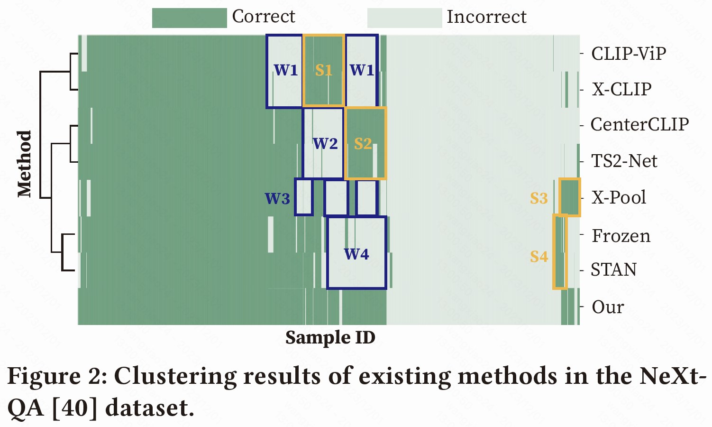
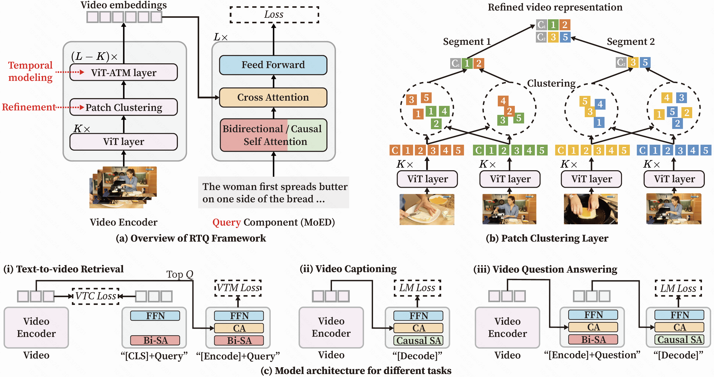
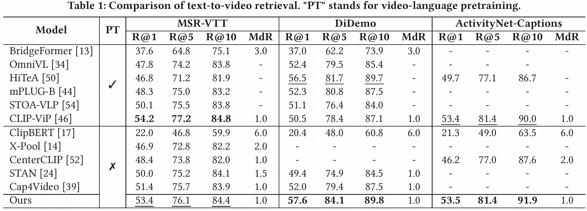
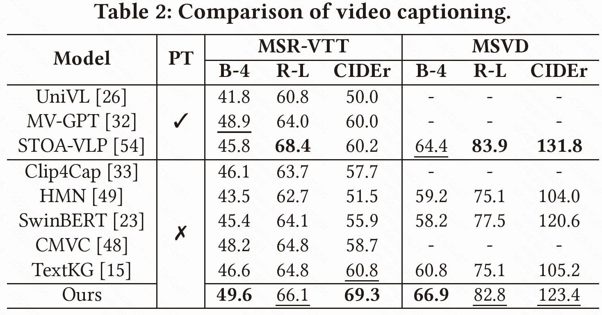
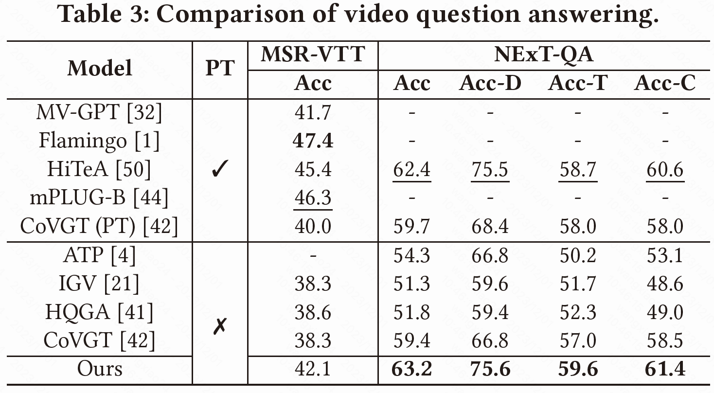

<h1 align="center"> <a href=https://arxiv.org/abs/2312.00347>RTQ: Rethinking Video-language Understanding <br/> Based on Image-text models</a></h2>


## :sparkles: Highlights

With a simple yet insightful framework **RTQ** (Refine, Temporal model, and Query), our model demonstrates outstanding performance even in the absence of video-language pre-training.


## :trophy: Contributions
1. Our systemic analysis reveals that current methods focus only on restricted aspects of video-language understanding, and they are complementary.
<p align="center">

</p>

2. We propose the RTQ framework to jointly model information redundancy, temporal dependency, and scene complexity in video-language understanding.


3. We demonstrate that, even without pre-training on video-languag data, our method can achieve superior (or comparable) performance with state-of-the-art pre-training methods.


## :bar_chart: Main Results

#### Text-to-video retrieval
<p align="center">

</p>

#### Video caption
<p align="center">

</p>

#### Video question answering
<p align="center">

</p>


## :wrench: Requirements and installation
- Python >= 3.8
- Pytorch >= 1.10.0
- CUDA Version >= 10.2
- Install required packages:
```bash
pip install -r requirements.txt
```

## :ship: Download datasets and pretrained models
Follow the instructions in `[REPO_HOME]/tools/data` to download all datasets. Put them in the `[REPO_HOME]/data` directory. You can use softlinks as well. 

Download BLIP model
```bash
mkdir [REPO_HOME]/modelzoo
wget https://storage.googleapis.com/sfr-vision-language-research/BLIP/models/model_base_capfilt_large.pth -P [REPO_HOME]/modelzoo/BLIP
```

The final file structure is:
```bash
- RTQ
  - assets
  - configs
  - data
    - msrvtt
      - txt_db
      - vis_db
    - nextqa
    ......
  - lavis
  - modelzoo
    - BLIP
      - model_base_capfilt_large.pth
  ......
```


## :rocket: Training & evaluation

See [code examples](./task.sh).


## :book: Citation
If you find our paper and code useful in your research, please consider giving a star :star: and citation :book:.

```BibTeX
@inproceedings{wang2023rtq,
  author       = {Xiao Wang and
                  Yaoyu Li and
                  Tian Gan and
                  Zheng Zhang and
                  Jingjing Lv and
                  Liqiang Nie},
  title        = {{RTQ:} Rethinking Video-language Understanding Based on Image-text
                  Model},
  booktitle    = {Proceedings of the {ACM} International Conference on Multimedia, 2023},
  pages        = {557--566},
  publisher    = {{ACM}},
  year         = {2023},
}
```


## :vulcan_salute: Acknowledgements
- [LAVIS](https://github.com/salesforce/LAVIS): great library in vision-language understanding.
- [mmaction2](https://github.com/open-mmlab/mmaction2): great toolbox for video understanding.
